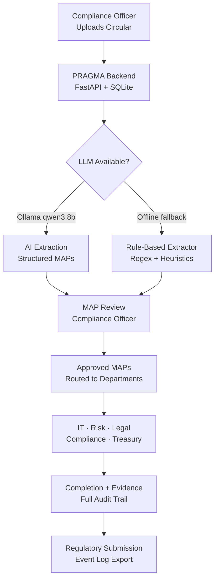
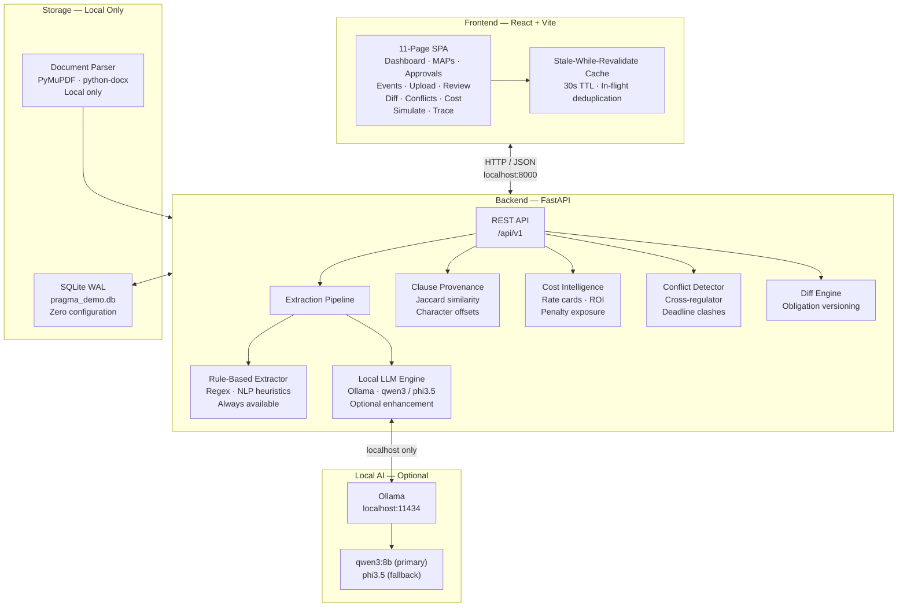

# PRAGMA
**Proactive Regulatory Autonomous Governance & Management Agent**

An air-gapped compliance intelligence platform that transforms regulatory circulars into routable, deadline-tracked action points — with full auditability, explainable AI, and cost intelligence.

Built for Indian banking institutions operating under RBI, SEBI, and MCA oversight.

---

## Problem

Indian banks receive dozens of regulatory circulars annually from RBI, SEBI, FEMA, and MCA. Each circular contains multiple compliance obligations that must be identified, assigned to the correct department, tracked against hard regulatory deadlines, approved through a compliance workflow, and evidenced during audits.

Today this process is **entirely manual**: compliance officers read circulars by hand, extract obligations by judgment, route tasks via email, and track progress in spreadsheets. Compliance gaps emerge not from negligence but from the absence of a structured, automated system.

The consequences are severe — RBI imposed penalties exceeding ₹500 crore on Indian banks in FY2023-24 for non-compliance, most of which were process failures rather than intent failures.

---

## Solution Overview

PRAGMA ingests a regulatory circular — as raw text or a PDF/DOCX/TXT file — and automatically extracts **Measurable Action Points (MAPs)**: discrete, routable, deadline-aware compliance obligations.

Each MAP is:
- Assigned to a responsible department (IT, Compliance, Risk, Treasury, Legal)
- Prioritised (Critical / High / Medium / Low) based on regulatory language signals
- Traced back to the exact sentence in the source circular that triggered it
- Routed through a human approval workflow with full audit trail
- Quantified: cost estimate, penalty exposure, and ROI of compliance

PRAGMA runs **completely offline**. No internet connection, no cloud API, no external LLM service is required at any point. All processing happens locally using a deterministic rule-based engine with optional local LLM enhancement via Ollama.



> **Humans supervise. PRAGMA orchestrates.**

---

## Key Features

### Core Intelligence Pipeline

| Feature | Description |
|---|---|
| **MAP Extraction Pipeline** | Two-layer engine: deterministic rule-based extraction (always available, zero dependencies) + optional local LLM enhancement via Ollama for complex multi-section circulars |
| **Explainable AI / Clause Provenance** | Every MAP is linked to the exact sentence in the source circular using Jaccard similarity with clause-anchored scoring. Character-offset highlighting shows precisely which clause produced which obligation — no black box |
| **Regulatory Diff Engine** | Compares two circular versions side-by-side, identifying added, removed, and modified obligations. Critical for tracking regulatory evolution and supersession |
| **Cross-Regulator Conflict Matrix** | Detects overlapping obligations, deadline clashes, and workload surges when RBI, SEBI, and MCA issue simultaneous directives to the same department |
| **Compliance Cost Intelligence** | Quantifies the financial burden of compliance per MAP and per department: implementation cost, effort in person-days, regulatory penalty exposure, and ROI — answering the question every CFO asks |
| **Impact Simulator** | Predicts downstream compliance effects before committing: workload redistribution, deadline pressure, and cross-department resource contention |

### Workflow & Operations

| Feature | Description |
|---|---|
| **Approval Workflow** | Compliance officers review, approve, or reject extracted MAPs with notes. Full status lifecycle: Pending → Approved → In Progress → Completed |
| **Action Point Register** | Filterable, searchable register of all MAPs across all circulars with deadline tracking and department assignment |
| **AI Extraction Review** | Side-by-side panel showing the source circular with highlighted evidence sentences alongside the extracted MAP — enabling human validation of every AI decision |
| **Audit Event Ledger** | Immutable, timestamped log of every system action: uploads, extractions, approvals, status changes, with actor attribution |
| **Compliance Traceability Graph** | Visual graph tracing the full lifecycle from circular → MAP → department → completion |

### Offline & Enterprise

| Feature | Description |
|---|---|
| **Air-Gapped Architecture** | Zero external dependencies at runtime. Works with WiFi disconnected and Ollama stopped. No data leaves the machine |
| **Local Document Ingestion** | Upload PDF, DOCX, DOC, or TXT regulatory circulars. Parsed locally via PyMuPDF and python-docx — no cloud OCR |
| **Graceful Degradation** | When Ollama is unavailable, rule-based extraction activates automatically. All 11 platform features remain fully operational |
| **Enterprise Dashboard** | Command-centre view: KPI strip, critical action alerts, department risk heatmap, compliance lifecycle pipeline, cost intelligence summary, workload distribution |
| **Dark Mode** | Full dark mode with professional design system: IBM Plex type family, Canara Bank navy/brass colour tokens, WCAG-compliant contrast |
| **Demo Mode** | Single-endpoint demo reset seeds three realistic regulatory scenarios with 14 MAPs, approvals, and a full audit trail |

---

## System Architecture



**Key architectural properties:**
- No request ever leaves the machine
- Every feature degrades gracefully when AI is unavailable
- SQLite with WAL journaling provides data durability without a database server
- Async LLM enhancement returns rule-based results immediately; LLM results update the record in the background

---

## Tech Stack

| Layer | Technology | Notes |
|-------|-----------|-------|
| Frontend | React 18, Tailwind CSS, Recharts | Vite build, lazy-loaded pages |
| Backend | FastAPI, Python 3.11+ | Async, BackgroundTasks for LLM |
| Database | SQLite (WAL journal) | Auto-created on startup, no setup required |
| AI (optional) | Ollama — qwen3:8b / phi3.5 | Falls back to rule-based extractor if unavailable |
| ORM | SQLAlchemy 2.0 | Tables auto-created via `create_all_tables()` |
| Extraction fallback | Regex + obligation heuristics | Fully offline, zero latency |
| Document parsing | PyMuPDF + python-docx | Local PDF/DOCX extraction, no cloud OCR |

---

## Security

- Input sanitisation: path traversal prevention on filenames, control character stripping
- CORS: restricted to localhost origins only (not open to the network)
- No secrets in source: `.env.example` contains no credentials

---

## Installation

### Prerequisites

| Requirement | Version | Notes |
|---|---|---|
| Python | 3.11+ | |
| Node.js | 18+ | |
| Ollama | Latest | Optional — for LLM-enhanced extraction |

### 1. Clone the repository

```bash
git clone https://github.com/AnoushkaNag/PRAGMA.git
cd PRAGMA
```

### 2. Backend setup

```bash
cd backend

# Create and activate virtual environment
python -m venv venv

# Activate (Windows)
.\venv\Scripts\activate

# Activate (macOS / Linux)
source venv/bin/activate

# Install dependencies
pip install -r requirements.txt
```

### 3. Configure environment (optional)

All defaults work out of the box with no configuration required. To customise:

```bash
cp .env.example .env
```

```env
# .env — all values are optional; shown values are defaults
AI_ENGINE=ollama            # Set to "rule_based" to disable Ollama entirely
OLLAMA_URL=http://localhost:11434
OLLAMA_MODEL=qwen3:8b
DATABASE_URL=sqlite:///./pragma_demo.db
```

### 4. Start the backend

```bash
uvicorn app.main:app --reload --port 8000
```

The backend creates the SQLite database and seeds departments automatically on first startup.

- API: `http://localhost:8000`
- Swagger docs: `http://localhost:8000/docs`

### 5. Ollama setup (optional)

```bash
# Install Ollama: https://ollama.com

# Pull the recommended model (2.2 GB, runs on 4 GB RAM):
ollama pull phi3.5

# Or for higher extraction quality (requires 8 GB RAM):
ollama pull qwen3:8b

# Start Ollama
ollama serve
```

PRAGMA auto-selects the best available pulled model. If no model is available, rule-based extraction activates automatically with no user action required.

### 6. Frontend setup

```bash
cd frontend
npm install
npm run dev
```

Frontend runs at: `http://localhost:5173`

### 7. Seed demo data

```bash
# Seeds 3 regulatory circulars + 14 MAPs + full audit trail
curl -X POST http://localhost:8000/api/v1/demo/reset
```

This seeds:
- **RBI Master Direction — Digital Lending Guidelines 2024** (5 MAPs)
- **SEBI Circular — Cybersecurity and Cyber Resilience Framework 2024** (4 MAPs)
- **RBI Master Direction — KYC and AML 2024** (5 MAPs)
- 2 approvals, 10 audit events, and full clause provenance for all MAPs

---

## Demo Flow

Recommended 5-minute demonstration sequence:

**1. Seed and orient (30 sec)**
Run demo reset. Open the Command Dashboard. Show the KPI strip (circulars ingested, critical actions, overdue MAPs, compliance score) and the Compliance Investment Intelligence widget (total implementation cost vs. total penalty exposure — the ROI argument).

**2. Upload a live circular (60 sec)**
Navigate to Circular Ingestion. Upload a real RBI/SEBI circular PDF. MAPs are extracted and returned in under 2 seconds with department routing, priority classification, deadlines, and confidence scores.

**3. Explainability (60 sec)**
Navigate to AI Extraction Review. Click any MAP. The source circular highlights the exact sentence that triggered the extraction. This is the differentiator — every AI decision is traceable to a specific clause.

**4. Approval workflow (30 sec)**
Navigate to Compliance Review Queue. Approve a Critical MAP. The status transitions and the audit event is logged automatically with timestamp.

**5. Intelligence features (90 sec)**
- **Conflict Matrix**: show cross-regulator deadline clash between RBI Digital Lending and SEBI Cybersecurity obligations landing on the IT department in the same 14-day window
- **Cost Intelligence**: per-department cost breakdown, ₹ penalty exposure, ROI of compliance
- **Regulatory Diff**: compare two circular versions — added, removed, modified obligations highlighted

**6. Offline proof (30 sec)**
Disconnect WiFi. Stop Ollama. Reload the browser. Every feature continues operating. Upload a new circular — MAPs extracted in under 2 seconds by the rule-based engine.

---

## Project Structure

```
PRAGMA/
├── backend/
│   ├── app/
│   │   ├── api/v1/
│   │   │   ├── router.py              # Aggregates all routers
│   │   │   └── endpoints/
│   │   │       ├── circulars.py       # Upload · parse · extract
│   │   │       ├── maps.py            # MAP CRUD · status transitions
│   │   │       ├── approvals.py       # Compliance review workflow
│   │   │       ├── events.py          # Audit event ledger
│   │   │       ├── departments.py     # Department registry
│   │   │       ├── simulate.py        # Impact simulation
│   │   │       ├── insights.py        # Diff · Conflicts · Cost · Provenance
│   │   │       └── demo.py            # Demo reset · status
│   │   ├── models/                    # SQLAlchemy ORM models
│   │   ├── schemas/                   # Pydantic request/response schemas
│   │   ├── services/
│   │   │   ├── ai_engine.py           # Extraction router (Ollama → rule-based)
│   │   │   ├── rule_extractor.py      # Deterministic MAP extraction
│   │   │   ├── ollama_service.py      # Local LLM integration
│   │   │   ├── enhancement_service.py # Async background LLM enhancement
│   │   │   ├── provenance_service.py  # Clause-to-MAP evidence linkage
│   │   │   ├── cost_service.py        # Financial burden quantification
│   │   │   ├── conflict_service.py    # Cross-regulator conflict detection
│   │   │   ├── diff_service.py        # Obligation version comparison
│   │   │   ├── document_parser.py     # Local PDF/DOCX text extraction
│   │   │   ├── map_service.py         # MAP creation and routing
│   │   │   └── event_service.py       # Audit event logging
│   │   ├── config.py                  # Settings via pydantic-settings
│   │   ├── database.py                # SQLAlchemy engine · session · WAL
│   │   └── main.py                    # FastAPI app factory · lifespan
│   ├── alembic/                       # Schema migration history
│   ├── tests/                         # Backend test suite
│   ├── requirements.txt
│   └── alembic.ini
│
├── frontend/
│   └── src/
│       ├── api/                       # Backend call functions
│       ├── components/
│       │   ├── layout/                # Sidebar, TopBar
│       │   └── shared/                # Reusable UI components
│       ├── contexts/                  # AppContext, ThemeContext
│       ├── hooks/                     # useMaps · useCirculars · useEvents · useBackendStatus
│       ├── layouts/                   # DashboardLayout
│       ├── pages/                     # 11 route-level page components
│       ├── services/                  # Axios instance · dataCache (SWR)
│       └── utils/                     # Formatters · constants
│
└── docs/                              # Architecture and API documentation
```

---

## Reliability Features

| Feature | Implementation |
|---|---|
| **Offline-first data hooks** | Stale-while-revalidate cache (30s TTL) — pages render from cache while background revalidation occurs |
| **In-flight deduplication** | `fetchOnce()` in `dataCache.js` prevents duplicate parallel requests when multiple components mount simultaneously |
| **Mock data fallback** | All hooks fall back to representative mock data when backend is unreachable; user sees a banner, not an error page |
| **Startup grace period** | `useBackendStatus` waits 12 seconds before marking backend offline — prevents false "offline" flash during cold boot |
| **AI fallback chain** | `ai_engine.py` never raises — always returns MAPs regardless of Ollama state |
| **Async LLM enhancement** | LLM extraction runs as a BackgroundTask; rule-based results are returned immediately |
| **React Error Boundary** | Wraps the entire application — any component crash shows a recovery screen instead of a blank page |
| **Lazy code splitting** | 9 of 11 pages are loaded on demand, reducing initial bundle by ~180 KB |

---

## Compliance Coverage

PRAGMA extraction has been validated against circulars from:

| Regulator | Coverage Areas |
|---|---|
| **RBI** | Digital Lending, KYC/AML, IT Risk, Cybersecurity, Liquidity Management |
| **SEBI** | CSCRF, Cybersecurity Framework, Mutual Fund Regulations |
| **MCA** | Corporate governance, reporting obligations |

---

## Team

| Name | Contribution |
|------|-------------|
| Anoushka Nag | Architecture, air-gapped migration, cost intelligence, provenance, enterprise hardening |
| Ashwin Yadav | Frontend scaffold, backend integration, design system |
| Anuja Chakraborty | Data pipeline, test suite, SQLAlchemy compatibility |
| Diyasha Nag | Backend APIs, approval workflow |
| Diptanshu Vishwa | Database layer |

See [CONTRIBUTORS.md](CONTRIBUTORS.md) for detailed per-person attribution.

---

## Documentation

| Document | Description |
|----------|-------------|
| [Architecture](docs/architecture.md) | System design and component overview |
| [API Reference](docs/api-reference.md) | All backend endpoints |
| [Database Schema](docs/database-schema.md) | SQLite tables and relationships |
| [Demo Script](docs/demo-script.md) | 5-minute demo runbook |
| [Contributors](CONTRIBUTORS.md) | Detailed team attribution |

---

*PRAGMA — Air-Gapped Compliance Intelligence Platform for Canara Bank*
*v1.0.0 · Offline Ready · RBI / SEBI / MCA*
