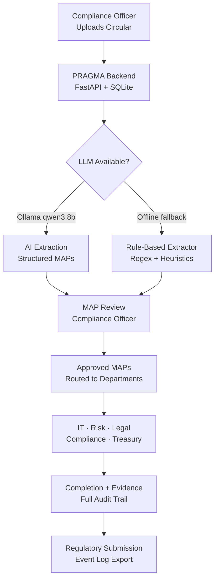

# PRAGMA
### Proactive Regulatory Autonomous Governance & Management Agent

An air-gapped compliance intelligence platform that transforms RBI, SEBI, and MCA regulatory circulars into structured, tracked, and auditable action plans — with zero external API dependencies.

---

## Problem

Banks process regulatory circulars manually: reading dense documents, identifying required actions, routing tasks through email, and assembling evidence at audit time. This process is slow, fragmented, and error-prone. Compliance gaps emerge not from negligence but from the absence of a structured, automated workflow.

---

## What PRAGMA Does

PRAGMA ingests a regulatory circular and outputs **Measurable Action Points (MAPs)** — department-specific, trackable obligations with full lifecycle traceability from extraction to evidence.



| Step | What Happens |
|------|-------------|
| 1 | Compliance officer uploads circular via web UI |
| 2 | PRAGMA extracts Measurable Action Points (MAPs) — AI-assisted or rule-based |
| 3 | Officer reviews, edits, and approves each MAP |
| 4 | MAPs auto-routed to responsible departments |
| 5 | Departments mark tasks complete with evidence |
| 6 | Full audit trail maintained in tamper-evident event log |

> **Humans supervise. The system orchestrates.**

---

## Architecture

PRAGMA is designed for **air-gapped deployment**: no internet access, no external API keys, no cloud dependencies. Everything runs on-premises.

```
Circular Upload
      │
      ▼
┌─────────────────────────────────────────────────────┐
│  PRAGMA Backend  (FastAPI · Python 3.11)            │
│                                                     │
│  ┌─────────────┐   ┌─────────────────────────────┐ │
│  │ AI Engine   │   │ Rule-Based Extractor        │ │
│  │ Ollama      │   │ Regex + Obligation Patterns │ │
│  │ qwen3:8b /  │   │ Zero external dependencies  │ │
│  │ phi3.5      │   │                             │ │
│  └──────┬──────┘   └────────────┬────────────────┘ │
│         │  primary              │  fallback         │
│         └──────────┬────────────┘                  │
│                    ▼                                │
│          MAP Extraction + Routing                   │
│                    │                                │
│                    ▼                                │
│  ┌──────────────────────────────────────────────┐  │
│  │  SQLite (WAL mode)                           │  │
│  │  circulars · maps · events · departments     │  │
│  └──────────────────────────────────────────────┘  │
└─────────────────────────────────────────────────────┘
      │
      ▼
┌─────────────────────────────────────────────────────┐
│  PRAGMA Frontend  (React 18 · Tailwind · Recharts)  │
│  Dashboard · MAP Register · Approvals · Audit Log   │
└─────────────────────────────────────────────────────┘
```

---

## Tech Stack

| Layer | Technology | Notes |
|-------|-----------|-------|
| Frontend | React 18, Tailwind CSS, Recharts | Vite build, lazy-loaded pages |
| Backend | FastAPI, Python 3.11+ | Async, BackgroundTasks for LLM |
| Database | SQLite (WAL journal) | Auto-created on startup, no setup required |
| AI (optional) | Ollama — qwen3:8b / phi3.5 | Falls back to rule-based extractor if unavailable |
| ORM | SQLAlchemy 2.0 | No Alembic migrations needed — tables auto-created |
| Extraction fallback | Regex + obligation heuristics | Fully offline, zero latency |

---

## Key Features

- **Air-gapped operation** — works fully offline; Ollama is optional
- **Graceful degradation** — qwen3:8b → phi3.5 → rule-based extractor → mock data
- **Traceability** — every MAP links back to the exact clause in the source circular
- **Approval workflow** — compliance officers review and approve before routing
- **Audit trail** — tamper-evident event log for every status change
- **Cost intelligence** — tracks compliance spend by department and regulation
- **Provenance scoring** — Jaccard + clause-anchored similarity for MAP-to-regulation mapping
- **Demo reset** — seeds 3 circulars + 14 MAPs + audit trail in one API call

---

## Local Setup

### Prerequisites

- Python 3.11+
- Node.js 18+
- [Ollama](https://ollama.ai) *(optional — system works without it)*

### 1. Clone the repository

```bash
git clone https://github.com/AnoushkaNag/PRAGMA.git
cd PRAGMA
```

### 2. Backend setup

```bash
cd backend

# Create virtual environment
python -m venv venv

# Activate — Windows
.\venv\Scripts\activate
# Activate — macOS / Linux
source venv/bin/activate

# Install dependencies
pip install -r requirements.txt

# Configure environment (SQLite, no external keys required)
cp .env.example .env

# Start server — SQLite database is created automatically
python run.py
```

Backend runs at: `http://localhost:8000`  
API docs: `http://localhost:8000/docs`

### 3. Frontend setup

```bash
cd frontend

# Install dependencies
npm install

# Start development server
npm run dev
```

Frontend runs at: `http://localhost:5173`

### 4. Optional: Enable AI extraction with Ollama

```bash
# Install Ollama from https://ollama.ai, then pull the model
ollama pull qwen3:8b

# Start Ollama (runs as a local service)
ollama serve
```

PRAGMA will automatically detect Ollama on startup. If unavailable, extraction falls back to the built-in rule-based engine — no configuration change needed.

### 5. Load demo data

```bash
# Seeds 3 regulatory circulars + 14 MAPs + full audit trail
curl -X POST http://localhost:8000/api/v1/demo/reset
```

---

## Repository Structure

```
PRAGMA/
├── backend/                        # FastAPI application
│   ├── app/
│   │   ├── api/v1/
│   │   │   ├── router.py           # Route aggregator
│   │   │   └── endpoints/          # circulars, maps, events, demo, insights
│   │   ├── models/                 # SQLAlchemy ORM models
│   │   ├── schemas/                # Pydantic request/response schemas
│   │   ├── services/
│   │   │   ├── ai_engine.py        # Ollama integration + fallback chain
│   │   │   ├── map_service.py      # MAP creation and routing
│   │   │   ├── provenance_service.py # Clause-anchored MAP traceability
│   │   │   ├── cost_service.py     # Compliance cost tracking
│   │   │   └── event_service.py    # Audit event logging
│   │   ├── utils/
│   │   │   └── rule_extractor.py   # Offline regex-based MAP extraction
│   │   ├── config.py               # App settings via pydantic-settings
│   │   ├── database.py             # SQLAlchemy engine + auto-create tables
│   │   └── main.py                 # FastAPI app factory
│   ├── tests/                      # Backend test suite
│   ├── requirements.txt
│   └── .env.example
│
├── frontend/                       # React application
│   └── src/
│       ├── api/                    # Backend API call functions
│       ├── components/             # Reusable UI components
│       ├── contexts/               # React global state
│       ├── hooks/                  # Custom React hooks (with caching)
│       ├── pages/                  # Route-level page components
│       └── utils/                  # Constants, formatters
│
└── docs/                           # Architecture and API reference
    ├── architecture.md
    ├── api-reference.md
    ├── database-schema.md
    └── demo-script.md
```

---

## Team

| Name | Contribution |
|------|-------------|
| Anoushka Nag | Architecture, air-gapped migration, cost intelligence, provenance, enterprise hardening |
| Ashwin Yadav | Frontend scaffold, backend integration, design system |
| Anuja Chakraborty | Data pipeline, test suite, SQLAlchemy compatibility |
| Diyasha Nag | Backend APIs, approval workflow |
| Diptanshu Vishwa | Database layer |

---

## Documentation

| Document | Description |
|----------|-------------|
| [Architecture](docs/architecture.md) | System design and component overview |
| [API Reference](docs/api-reference.md) | All backend endpoints |
| [Database Schema](docs/database-schema.md) | SQLite tables and relationships |
| [Demo Script](docs/demo-script.md) | 4-minute demo runbook |
